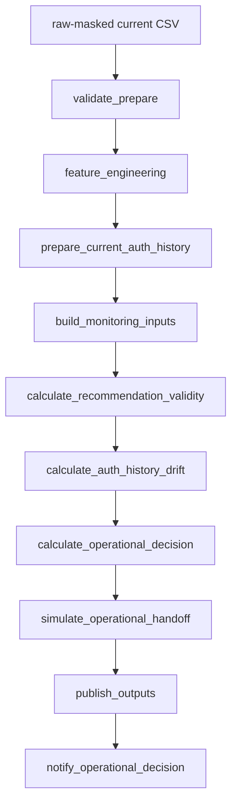

# Pipeline AUTH Monitoring

El pipeline default corre el monitoreo AUTH de punta a punta en Azure ML.



## Inputs

| Input | Uso |
|---|---|
| `storage_account` | Storage funcional del proyecto |
| `input_blob_path` | raw current masked para validacion/preparacion |
| `baseline_snapshot_container` | contenedor del baseline |
| `baseline_snapshot_blob_path` | snapshot de recomendaciones baseline |
| `current_history_container` | contenedor del current raw |
| `current_history_blob_path` | current raw usado por feature engineering |
| `job_identity_client_id` | managed identity usada para Storage |

## Outputs

El pipeline publica en:

```text
environment=<env>/compute=azure-ml/trigger=batch-endpoint/owner=<owner>/run_date=<yyyymmdd>/run_id=<run_id>/
```

Archivos clave:

- `snapshots/baseline_recommendation_snapshot.csv`
- `snapshots/current_auth_history_snapshot_real.csv`
- `logs/auth_recommendation_validity_log.csv`
- `logs/auth_history_drift_log.csv`
- `logs/new_combo_without_baseline_recommendation_log.csv`
- `summaries/run_readiness_summary.csv`
- `summaries/operational_decision_summary.csv`
- `manifest/artifact_manifest.json`

## Interpretacion Minima

`run_readiness_summary.csv` contiene:

- `run_readiness_status`
- `recommended_operational_action`
- `recommendation_validity_global_status`
- `auth_history_drift_status`
- `price_drift_status`
- `new_combo_count`

Una corrida `Completed` valida operacion end-to-end. La paridad exacta contra notebooks queda como validacion separada cuando cambian preparaciones o thresholds.
